<h1 align="center">Jobico</h1>
<h3 align="center">Job Search Platform</h3>

---

## 📝 Jobico - Job Search Platform


This is the final project for the Advanced API Development module (ITS1114) at the Institute of Software Engineering (IJSE).

| Student Name | Buddhika Fernando |
| ------------ | ----------------- |
| Batch Number | GDSE 71 |

---

## 📋 Table of Contents

* [Project Overview](#project-overview)
* [Unique Highlights](#unique-highlights)
* [Key Features](#key-features)
  * [For Job Seekers](#for-job-seekers)
  * [For Employers/Admins](#for-employersadmins)
* [Technology Stack](#technology-stack)
  * [Backend](#backend)
  * [Frontend](#frontend)
  * [Tools](#tools)
* [Project Structure](#project-structure)
* [Screenshots](#screenshots)
* [Setup and Installation Guide](#setup-and-installation-guide)
  * [Prerequisites](#prerequisites)
  * [Backend Setup](#backend-setup)
  * [Application Properties Setup](#application-properties-setup)
  * [Frontend Setup](#frontend-setup)
* [YouTube Project Demo](#youtube-project-demo)
* [Future Enhancements](#future-enhancements)
* [License](#license)
* [Contact](#contact)


---

## 📖 Project Overview

Jobico is a web-based **job search platform** that connects job seekers with employers. Users can **browse jobs, submit applications, and track their application status**, while employers can **post jobs, manage applicants, and view reports**.  

Built with **Java Spring Boot, JSP/Servlets, MySQL, and JavaScript**, Jobico provides a **responsive and user-friendly experience** for both desktop and mobile users.

---

## 🌟 Unique Highlights

✅ **Role-Specific Dashboards** – Separate interfaces for **Job Seekers** and **Employers/Admins**.  
✅ **Dynamic Job Search** – Real-time filtering by keywords, categories, and locations.  
✅ **Interactive Job & Applicant Modals** – View job details and applicant profiles without page reloads.  
✅ **Application Tracking** – Track the status of applications: Submitted, Reviewing, Interview, Rejected.  
✅ **Secure Authentication** – JWT-based login system with role-based access control.  
✅ **Modern UI** – Clean, user-friendly interface with badges, highlights, and intuitive layout.  

---

## ✨ Key Features

### 👤 For Job Seekers

* Secure registration and login with JWT authentication  
* Browse available jobs and view detailed job descriptions  
* Submit applications online for selected jobs  
* Track application status (Submitted, Reviewing, Interview, Rejected)  
* View personal dashboard with applied jobs and statuses  
* Receive notifications for status updates  

### 🛠 For Employers/Admins

* Manage job postings and company profiles  
* Post new jobs and assign details like location, salary, and requirements  
* Review and manage applicant submissions  
* Approve or reject applications  
* Generate reports on jobs, applications, and applicant statuses  
* View applicant resumes and profiles  

---

## 🛠 Technology Stack

### 🔹 Backend

* Framework: Spring Boot 3.x  
* Language: Java 17  
* Security: Spring Security + JWT  
* Database: MySQL  
* ORM: Spring Data JPA / Hibernate  
* API: RESTful APIs  
* Build Tool: Maven  

### 🔹 Frontend

* Languages: HTML, CSS, JavaScript  
* Libraries: jQuery, SweetAlert2  

### 🔹 Tools

* IDE: IntelliJ IDEA (Backend), VS Code (Frontend)  
* API Testing: Postman  
* Database Management: MySQL Workbench  
* Version Control: Git & GitHub  

---

## 🗂 Project Structure

This section shows the complete project structure for **Jobico**, including backend, frontend, and configuration files.

```
Jobico/
├── src/
│   └── main/
│       └── java/
│           └── com/
│               └── jobico/
│                   ├── config/               # Security, JWT, and app configurations
│                   ├── controller/           # REST Controllers (AuthController, JobController, etc.)
│                   ├── dto/                  # Data Transfer Objects
│                   ├── entity/               # JPA Entities (JobPost.java, JobSeeker.java, Application.java, etc.)
│                   ├── exceptions/           # Custom exception classes & handlers
│                   ├── repo/                 # Spring Data JPA repositories
│                   ├── service/              # Service interfaces & implementations
│                   ├── util/                 # Utility classes (helpers, constants, etc.)
│                   └── JobicoApplication.java   # Main Spring Boot application class
│
├── resources/
│   ├── application.properties      # Spring Boot configuration
│   ├── static/                     # Static resources (images, css, js)
│   └── templates/                  # JSP templates
│
├── test/                            # Unit and integration tests
├── target/                          # Compiled build output (generated by Maven)                     
├── FrontEnd/
│   ├── css/                         # Custom stylesheets
│   ├── js/                          # JavaScript files (API calls, job management logic)
│   ├── Admin.html
│   ├── JobSearch.html
│   ├── JobDetails.html
│   └── Login.html
│
├── .gitignore
├── HELP.md
├── mvnw
├── mvnw.cmd
└── pom.xml                          # Maven build file
```


---

## 📸 Screenshots

1. Home Page  
   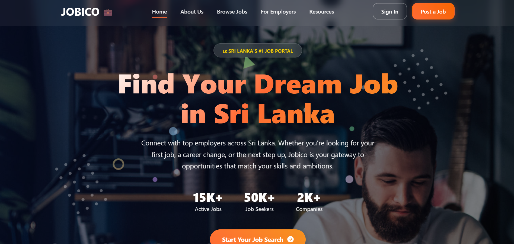

2. Job Seeker Dashboard  
   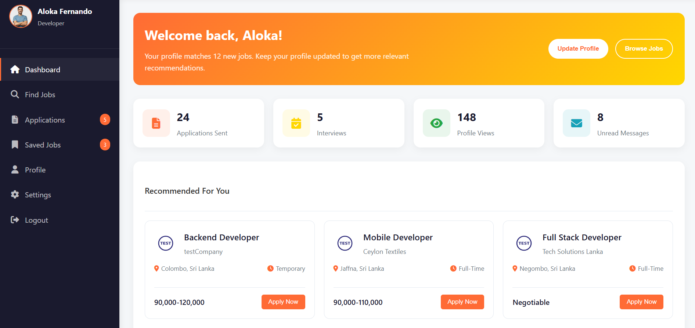

3. Job Searching Page  
   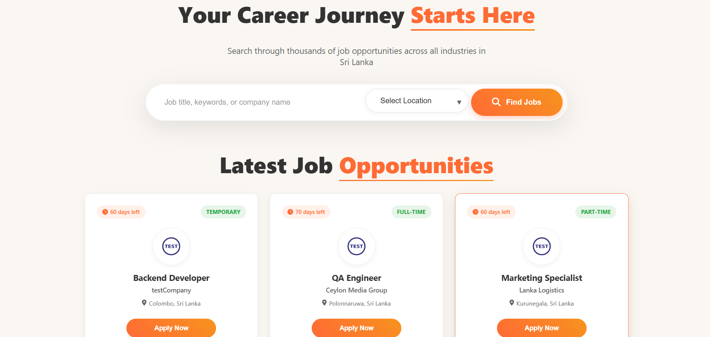

4. Job Filtering Page  
   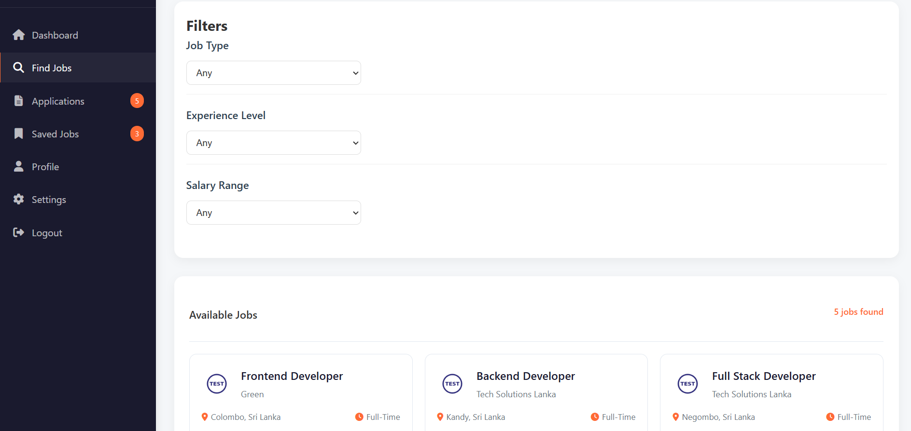

5. Job Description Page  
   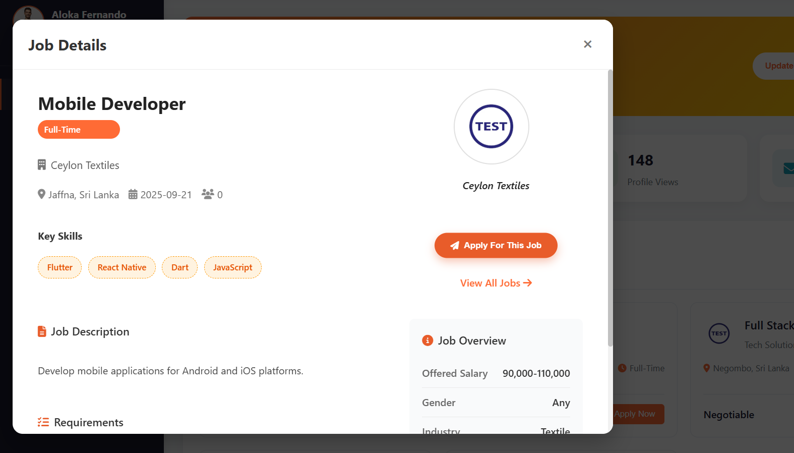

6. Job Posting Page  
   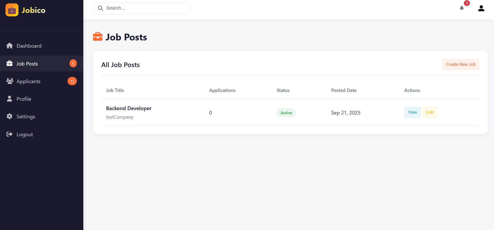

7. Job Posts Management Page (Admin)  
   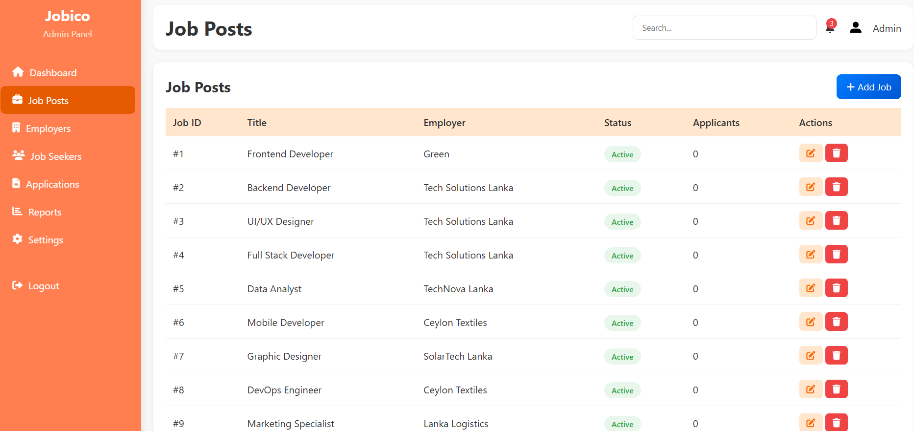

8. Application History Page  
   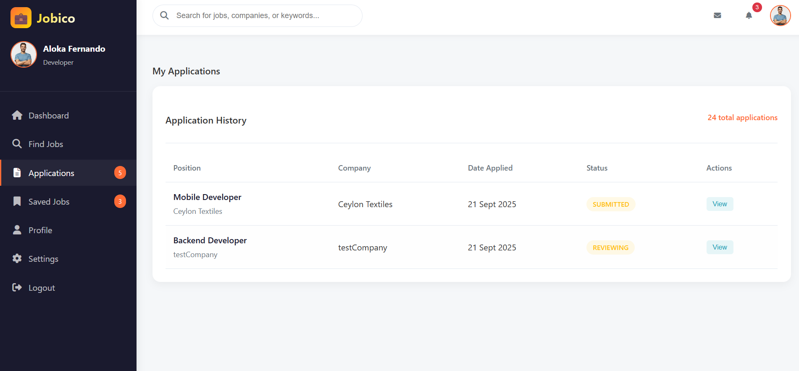

9. Applications Page  
   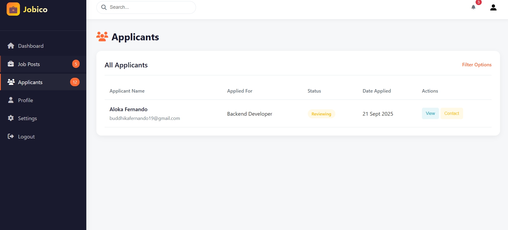

10. Employee Dashboard (Admin)  
    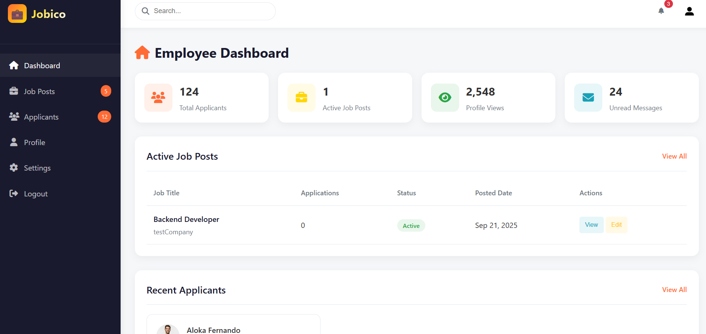

11. Employee Management Page  
    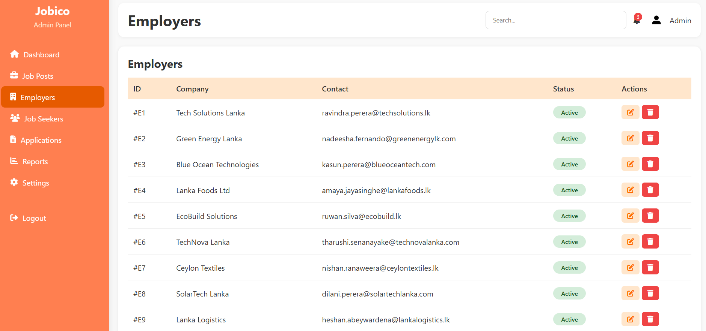

12. Employee Profile Page  
    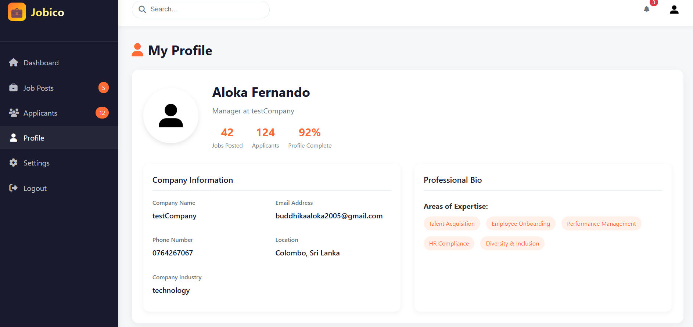

13. Seeker Profile Page  
    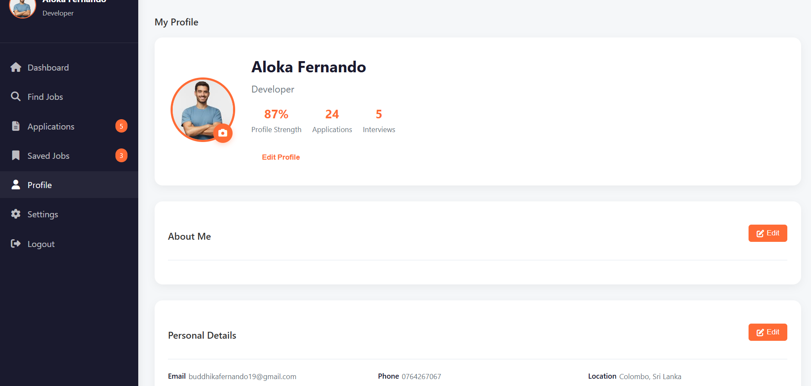

---

## 🚀 Setup and Installation Guide

### 🔹 Prerequisites

* Java 17+  
* Apache Maven 3.8+  
* MySQL Server  
* IntelliJ IDEA or any Java IDE  

### 🔹 Backend Setup

```bash
# Clone the repository
git clone https://github.com/your-username/jobico.git

# Navigate to backend folder
cd BackEnd/

# Configure Database
# - Create MySQL database: jobico_db
# - Update username & password in: src/main/resources/application.properties

# Build the project
mvn clean install

# Run the application
java -jar target/jobico-0.0.1-SNAPSHOT.jar

```

### ⚙️ Application Properties Setup

```properties
# Database Configuration
spring.datasource.url=jdbc:mysql://localhost:3306/jobico_db
spring.datasource.username=YOUR_DB_USER
spring.datasource.password=YOUR_DB_PASSWORD

# JWT Config
app.jwtSecret=YOUR_SECRET_KEY
app.jwtExpirationMs=86400000

# Server Port
server.port=8080

Before running the project, create a file:

`src/main/resources/application.properties`

Copy the content from `application-example.properties` and replace it with your own credentials.

---
### 🔹 Frontend Setup

```bash
cd FrontEnd/

```

* Open HTML files in a browser (or use VS Code Live Server).
* Update API endpoints in JS files if needed (e.g., http://localhost:8080).

---

## 🎬 YouTube Project Demo

👉 [Watch the Project Demo](https://youtu.be/your-demo-link)

> *Spring Boot Project - IJSE - GDSE71 - Panadura - Buddhika Fernando - Final Project*
---

## 🔮 Future Enhancements

🚀 Planned improvements for the next versions of *Jobico*:

* 📱 *Mobile App (Android/iOS)* – Native or Flutter app for on-the-go job searching and applications.  
* 🤖 *AI-Based Job Recommendations* – Suggests jobs to users based on skills, experience, and application history.  
* 🌍 *Multi-Language Support* – English, Sinhala, Tamil for Sri Lankan context.  
* 🔔 *Real-Time Notifications* – Live updates for new jobs, application status changes, and messages.  
* 📊 *Advanced Admin Dashboard* – Visual insights, reports, and statistics for employers/admins.  
* 💳 *Premium Features / Payment Gateways* – For paid job postings or recruiter subscriptions.

---

## 📜 License

This project is licensed under the *MIT License* – see the [LICENSE](LICENSE) file for details.

---

## 📧 Contact

📩 *Email*: [buddhika.fernando@example.com](mailto:buddhikafernando19@example.com)  
🔗 *LinkedIn*: [Buddhika Fernando](https://www.linkedin.com/in/buddhika-fernando-73606131a/)
